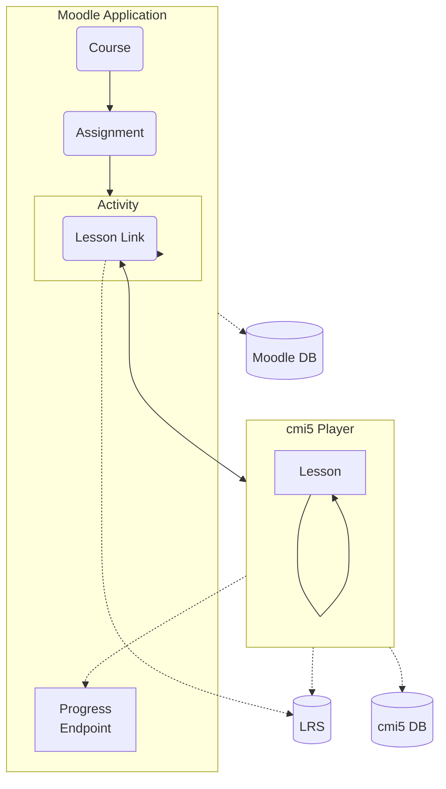
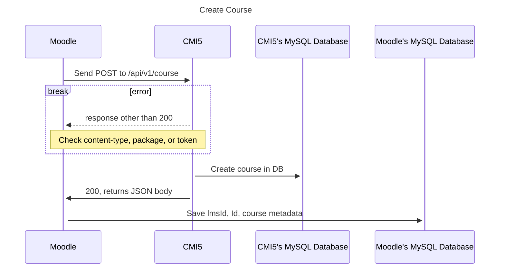
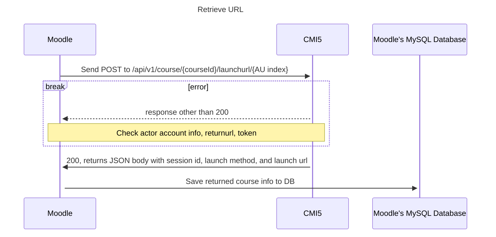

cmi5launch

============

A plug in for Moodle that enables tracking for cmi5 content.This plugin acts as a bridge between Moodle and a cmi5 player, as well as Moodle and an LRS, enabling recording and tracking of cmi5 statements. It utilizes the CATAPULT suite's cmi5 player which launches the content as well as handles AU satisfication statements. It also links with an LRS to display those statements and others generated by moodle. 

Users can upload the cmi5 content as a Moodle activity. It also integrates with Moodles Gradebook API for grading purposes. 

### Thanks

This plugin is based on the xAPI Launch Link (Tin can launch) plugin developed by David Pesce and Andrew Downes. That plugin is located at https://github.com/davidpesce/moodle-mod_tincanlaunch.

We also based many functions off examples from SCORM plugin that is packaged with Moodle.

## What you will need

To use this plugin you will need the following:

* Moodle 4.0+

* Login details for the admin account 

* A Moodle course setup where you would like to add the activity

* A cmi5 package in compliance with the cmi5 Specification (https://github.com/AICC/CMI-5_Spec_Current/blob/quartz/cmi5_spec.md)

* A Learning Record Store (LRS) as defined in the xAPI specification (https://opensource.ieee.org/xapi/xapi-base-standard-documentation)

* A running instance of the cmi5 prototype player (https://github.com/adlnet/CATAPULT/tree/main/player)

* A copy of this plugin

## Installation Instructions

Once the plugin is downloaded, be sure it is entirely in a file named 'cmi5launch.' Then compress that file into zip. The zip file _must_ be named 'cmi5_moodle.zip' to be uploaded to Moodle.

### Install plugin in Moodle

To install the CMI5 plugin into Moodle - 

- Go to _Site Administration_

- Go to _Plugins_

- Click on _Install Plugins_

  - Currently the only way to install plugin is via zip file

- Under _Install plugin from ZIP file_ upload the plugin. It must be in a zip file named 'cmi5_moodle.zip'.

  - Follow the Moodle instructions to upload plugin to the site

Once Moodle has finished uploading the plugin it will bring up the _cmi5 Launch Link_ settings page. This will enable you to set the information to connect to your LRS and instance of your running CMI5 player. These are the fields:

- Endpoint

  - The LRS endpoint, to enable the plugin to communicate with your LRS. Ex: https://lrsendpoint.com/data/xAPI/. Must include trailing forward slash.

- LRS integration 

  - This is an optional dropdown for addtional LRS's. Defaults to 'None.'

- LRS: Basic Username

  - The basic username for connecting to your LRS.

- LRS: Basic Password

  - Your password for connecting to your LRS. 

- Duration

   - Used with 'LRS integrated basic authentication'. Requests the LRS to keep credentials valid for this number of minutes. Default is set to 9000.

- Custom account homepage

  - If entered, Moodle will use this homePage in conjunction with the ID number user profile field to identify the learner. Defaults to https://moodle.com.

- Identify by email

  - If selected, learners will be identified by their email address if they have one recorded in Moodle.

- cmi5 Player URL : The URL to communicate with the CMI5 player, can include port number(e.g. http://player.example.com or http://localhost:63398). Must NOT include a trailing forward slash.
	- A note about dockerized containers: When working with Moodle as a docker image, to communicate with the player locally you need to get the local ip address through 'ifconfig' rather than using 'localhost' or '127.0.0.1'. So for instance, if your ip address is 10.10.0.15 you would place "http://10.10.0.15" as the url. Unless The player is on the same docker network as the Moodle container in which case it would be 'http://docker service name : docker internal port'
 	- Further, if using with nginx the variable 'PLAYER_API_ROOT' must be appended, example is 'http://docker-service-name:docker-internal-port/PLAYER_API_ROOT'	 	

- cmi5 Player: Basic Username

  - This is the tenant username for the CMI5 player

- cmi5 Player: Basic Password

  - This is the basic password to login to player.

- cmi5 Player: Bearer Token

  - The cmi5 tenant bearer token (should be a long string). 

The next section "Default values for CMI5 Launch Link activity grades" deals with the grade setting. 

- Grading method

  - How the overall grade for CMI5 activities is calculated. If "Highest" the highest grade will be used, if "Average" the scores will be averaged. 

- Maximum grade

  - The Maxium the grade can be (default 100).

The section "Default values for CMI5 Launch Link activity attempts and completion" can be ignored for now as it is a work in progress for future features. 

The plugin is now accessible as a resource to be added to a Moodle course! Under your Moodle courses in edit mode select _Add activity or resource_ and you will see _cmi5 Launch Link_ as an available option. Currently the Launch link can take a folder or XML compliant with cmi5 specification.

# Flowchart

This flowchart shows the path a user takes to get to a cmi5 Lesson Link. Once the link is clicked, the cmi5 Player opens in a new tab or window. The Moodle Application negotiates the connection by supplying credentials, tenant, and the current user session information. The Lesson Link contains a token in which both sides can track the user.

## Sequence diagrams for connecting to CMI5 player

Following are the two functions Moodle uses to create a course and retrieve a course URL from the CMI5 player.

### Create course

### Retrieve launch URL

## User progress

The CMI5 player tracks user progress by tracking whether an AU is satisfied or not. The LRS is a better way to track a users progress in any detail. Currently the Moodle plugin queries the LRS for progress. This in shows AUs as complete, in-progress, or not attempted. It also breaks down sessions into detail, ex; " The actor watched video at  certain time".

### Notes

#### Note about large packages.

You can control the size of file uploads to Moodle in Site Administration/General/Security/Site Security/Maximum uploaded file size. This setting is capped by the PHP settings post_max_size and upload_max_filesize, as well as the Apache setting LimitRequestBody. Be sure to increase these values, as well as php_max_execution or php_memory_limit if files are hanging. These can be adjusted in php.ini. If using Apache or similar their config files will need to be adjusted instead.

#### Notes about capabilities.

This plugin has a built in capability that allows users to view all the grades for a course, showing all enrolled user's grades. This is 'mod/cmi5launch:viewgrades'. It is automatically assigned to the roles of 'teacher' and 'course creator'. It can be added to other roles as required. 

## Database tables

This plugin use several of it's own tables. Their full descriptions can be seen in _db->install.xml_. This plugin tries to use the correct size and datatypes to account for different database languages Moodle supports. If there is a field error, database fields can be adjust in _Site Administration -> Development -> XMLDB editor_.

### Table  - cmi5launch        

This table is the main activity table. It holds the basics of a CMI5 activity. 

| Field name  | Field Type | Description |

| :---------- | :------------ |:------------ |

| id          | int           | Main ID assigned by Moodle|

| course      | int           | Course (id) cmi5launch activity belongs to |

| name		  | char		  | Name of course |

| intro       | text          | General introduction of the cmi5launch activity |

| introformat | int           | Format of the intro field (MOODLE, HTML, MARKDOWN...) |

| cmi5activityid | char       | The LMS id |

| registrationid | char       | Course registration ID returned by CMI5 player. We want to use this to connect to LRS |

| returnurl   | char          | Tenants return URL, where it will go after closing course from launch URL |

| courseid    | int           | This is the course ID returned from the CMI5 player |

| cmi5verbid  | char          | Unique verb ID |

| cmi5expiry  | int           | Number of days to expire completion after |

| overridedefaults | int      | Determines if the activity is inheriting the global defaults or has overridden them at the activity level |

| cmi5multipleregs | int      | Allow multiple registrations (not recommended) |

| timecreated | int           | The time the course was created |

| timemodified | int          | Last time the course was modified | 

| courseinfo  | text          | The full string of course info |

| aus         | text          | The AUs of the course, saved as array |

### Table  - cmi5launch_usercourse        

This table holds particular instances of a CMI5 activity (unique to user). 

| Field name  | Field Type | Description |

| :---------- | :------------ |:------------ |

| id          | int           | Main ID for tracking |

| courseid    | int           | Course ID, assigned by CMI5 player |

| userid      | int		      | User ID, combined with courseid can be used to retrieve unique records |

| cmi5launchurl | char        | Launch URL |

| introformat | int           | Format of the intro field (MOODLE, HTML, MARKDOWN...) |

| cmi5activityid | char       | The LMS id |

| registrationid | char       | Course registration ID returned by CMI5 player. We want to use this to connect to LRS |

| returnurl   | char          | Tenants return URL, where it will go after closing course from launch URL |

| aus         | text          | The AUs of the course, their DB IDs, saved as array |

| ausgrades   | text          | All the AUs and their grades (overall session grades) saved in this format: AU lmsid => [AU Title => [Scores from that title's sessions] ] |

| grade       | int           | The current overall grade for the course |

### Table cmi5launch_player        

This table stores the variables for API communication with the CMI5 player.

| Field name  | Field Type | Description |

| :---------- | :------------ |:------------ |

| id          | int           | The id of returned course IN MOODLE (This ID matches with the field ID in the cmi5launch table.) Moodle assigns ids sequentially. CMI5 also will assign course ids. These are separate. |

| name        | char          | Name field to hold the course name in Moodle. This may be different than the course name in it's own xml file. |

| tenantid    | int           | The Tenant ID. |

| tenantname  | char          | The name of the user for communication with the CMI5 player. This is set in plugin settings |

| courseid    | int           | The id of the returned course set by CMI5 player |

| Launchmethod | char         | Whether the  course's retrieved URL opens in it's own window or a new one |

| returnurl   | char          | The tenants return URL, where browser will redirect to after closing the course from launch URL | 

| homepage    | char          | The tenant's homepage |

| registrationid | char       | Course registration id returned by CMI5 player |

| sessionid   | int           | ID created for each session, when the AU launch url is requested |

| launchurl   | char          | The AU launchurl generated by and returned from the CMI5 player |

| cmi5playerurl | char        | The URL the CMI5 player is located at |

| cmi5playerport | int        | The port the CMI5 player can be communicated with (if applicable) |

### Table cmi5launch_sessions

This table stores information pertaining to each users individual session. Just as one course can have multiple AUs, one AU can have multiple sessions. Every time the user requests a launch link from the player a new session is started.

| Field name  | Field Type | Description |

| :---------- | :------------ |:------------ |

| id          | int           | Main ID for tracking, assigned by Moodle |

| sessionid   | int           | The session ID. Created by the CMI5 player and returned after launch URL request |

| userid      | int           | The user ID, which when combined with a course id can be used to retrieve unique records |

| registrationscoursesausid | int | ID assigned by player to AUs |

| tenantname  | char          | The tenant name |

| lmsid       | int           | The lmsid of the AU to match with object id from the LRS for pulling progress info |

| createdat   | char          | The time a session was started |

| updatedat   | char          | The time the session was last updated |

| code        | char          | Unique code for each session assigned by CMI5 player |

| launchtokenid | char        | Launchtoken assigned by CMI5 player |

| lastrequesttime | char      | Time a session was last requested |

| launchmode  | char          | Launch mode, which is separate then launchmethod. It can be 'Normal', 'Browse', or 'Review' |

| masteryscore | int          | The amount the score goes toward a masteryscore (may not be applicable) |

| score       | int           | The score of the session (returned from the 'result' parameter in statements from the LRS) |

| response    | text          | The response returned from 'result' parameter (in the statements from the LRS) |

| islaunched  | int           | Whether the session has been launched |

| isinitialized | int         | Whether the session has been initialized |

| initializedat | char        | Time a session was initialized |

| duration    | char          | Time a session lasted ( retrieved from 'result' parameter in statements from LRS) |

| iscompleted | int           | Whether the session has been completed |

| ispassed    | int           | Whether the session has been passed |

| isfailed    | int           | Whether the session has been failed |

| isterminated | int          | Whether the session has been terminated |

| isabandoned | int           | Whether the session has been abandoned |

| progress    | text          | The full string of the sessions progress reported in a statement from the LRS |

| courseid    | int           | The id of the course generated by the CMI5 player |

| launchmethod | char         | Whether the course's retrieved URL opens in it own window or not | 

| launchurl   | char          | The launch URL returned from the CMI5 player |

### Table cmi5launch_aus

This table stores information pertaining to each users individual AU. One course can have multiple AUs. 

| Field name  | Field Type | Description |

| :---------- | :------------ |:------------ |

| id          | int           | Main ID for tracking, assigned by Moodle |

| attempt     | int           | The attempt of the AU, ie, first, second, third, etc. |

| launchmethod | char         | Whether the course's retrieved URL opens in it own window or no |

| lmsid       | char          | The AU ID  from the course packet. The singular CMI5 compliant ID |

| url         | char          | The ending to be added to an URL to direct to a specific AU |

| type        | char          | The AU activity type |

| title       | char          | The AU title from the course package | 

| moveon      | char          | The requirements for the AU to be marked as done |

| auindex     | int           | The AU's index (used to separate the AUs in a CMI5 activity |

| parents     | char          | The AU's parent activities |

| objectives  | text          | The AU's objectives |

| description | text          | The AU's description |

| activitytype | char         | Activity type of AU |

| masteryscore | int          | The amount the score goes toward a masteryscore (may not be applicable) |

| completed   | int           | Whether an AU has met completed criteria (0 if false, 1 if true) |

| passed      | int           | Whether an AU has met passed criteria (0 if false, 1 if true) |

| inprogress  | int           | Whether an AU is in progress or not (has been started) (0 if false, 1 if true) |

| noattempt   | int           | Whether an AU has been attempted (0 if false, 1 if true)

| satisfied   | char          | Whether an AU has been satisfied (true, false, or null ) |

| sessions    | text          | The session IDs of the AU, saved as array |

| scores      | text          | The session's scores, saved as array |

| grade       | int           | The overall grade of the AU (based on what grade type setting is

