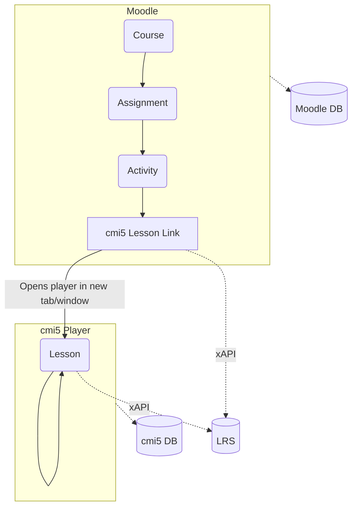

cmi5launch
============

A plug in for Moodle that allows the launch of cmi5 content which is then played in a cmi5 player and tracked to a separate LRS. 

## What you will need

To use this plugin you will need the following:

* Moodle 4 fully set up and running on a server that you have ftp access to 
* Login details for the admin account 
* A Moodle course setup where you would like to add the activity
* A piece of cmi5 compliant e-learning that also implements the launch mechanism outlined HERE, for example e-learning produced using Articulate Storyline or Adobe Captivate. This should be put on the internet somewhere, perhaps on your Moodle server. 
* A cmi5 compliant LRS (this plugin has been tested with Wax and SCORM Cloud) 
* A running instance of the cmi5 player (https://github.com/adlnet/CATAPULT/tree/main/player)
* A copy of this plugin.

## Notes

When installing from github, wrap this entire repository in a zip file named cmi5launch.zip

# User Flowchart

Thoughts... add a 'WebHook' to the cmi5 player... It allows you to send real-time data from one application to another whenever a given event occurs.