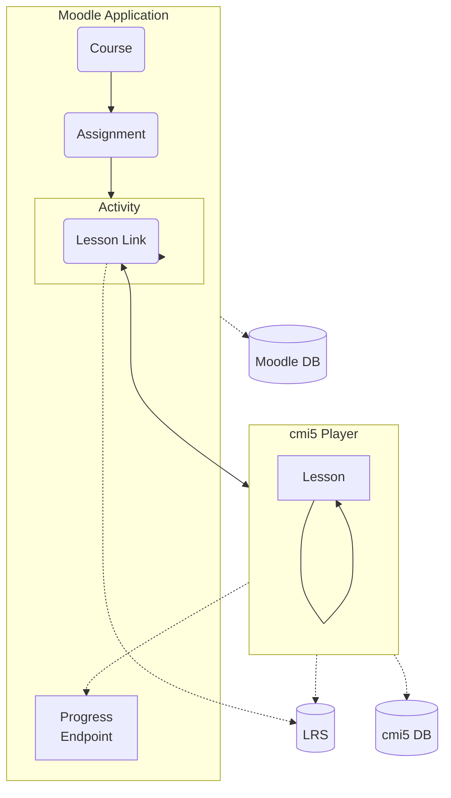
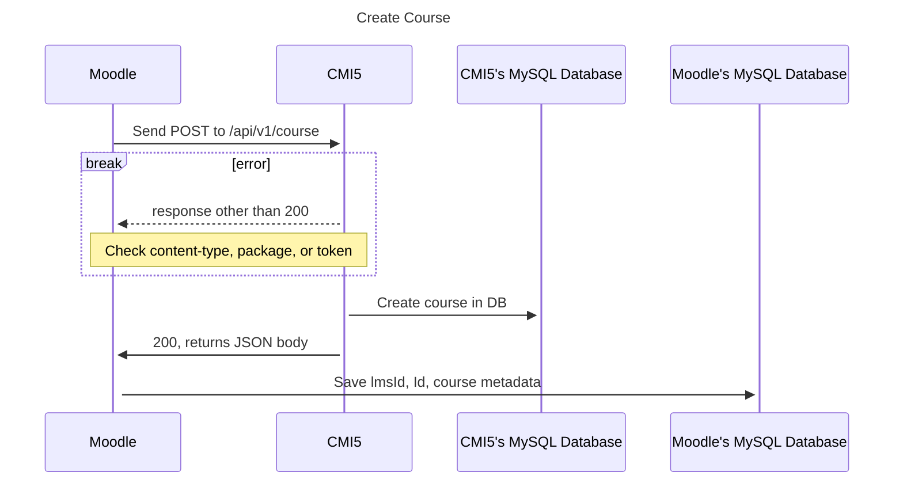
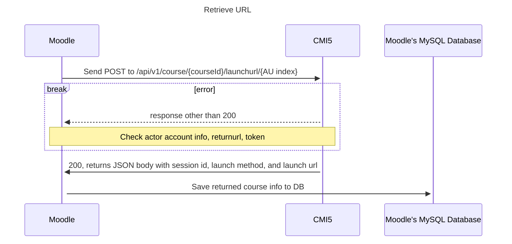

cmi5launch
============

A plug in for Moodle that allows the launch of cmi5 content which is then played in a cmi5 player and tracked to a separate LRS. 

## What you will need

To use this plugin you will need the following:

* Moodle 4.0+
* Login details for the admin account 
* A Moodle course setup where you would like to add the activity
* A piece of cmi5 compliant e-learning that also implements the launch mechanism, for example e-learning produced using Articulate Storyline or Adobe Captivate and packaged as a .zip file
* A cmi5 compliant LRS
* A running instance of the cmi5 player (https://github.com/adlnet/CATAPULT/tree/main/player)
* A copy of this plugin

## Notes

When installing from github, wrap this entire repository in a zip file named cmi5launch.zip

# Flowchart

This flowchart shows the path a user takes to get to a cmi5 Lesson Link. Once the link is clicked, the cmi5 Player opens in a new tab or window. The Moodle Application negotiates the connection by supplying credentials, tenant, and the current user session information. The Lesson Link contains a token in which both sides can track the user.

## Sequence diagrams for connecting to CMI5 player

Following are the two functions Moodle uses to create a course and retrieve a course URL from the CMI5 player.

### Create course

### Retrieve launch URL

## User progress

The cmi5 player tracks user progress, however the Moodle application will also want to track progress. Moodle will present the progress details to the user to let them know whether the lesson was completed, or how far along the user is in the lesson. This is not implemented yet.

### Introduce a webhook

Moodle and cmi5 Player do not currently share a user's progress. One option is for the cmi5 player to ping Moodle via a webhook whenever progress and/or completion has been made.

Webhooks are "user-defined HTTP callbacks". They are usually triggered by some event, such as pushing code to a repository or a comment being posted to a blog. When that event occurs, the source site makes an HTTP request to the URL configured for the webhook. Users can configure them to cause events on one site to invoke behavior on another.

One consideration is that the cmi5 Player will also need private credentials to request a progress update and/or completion.
