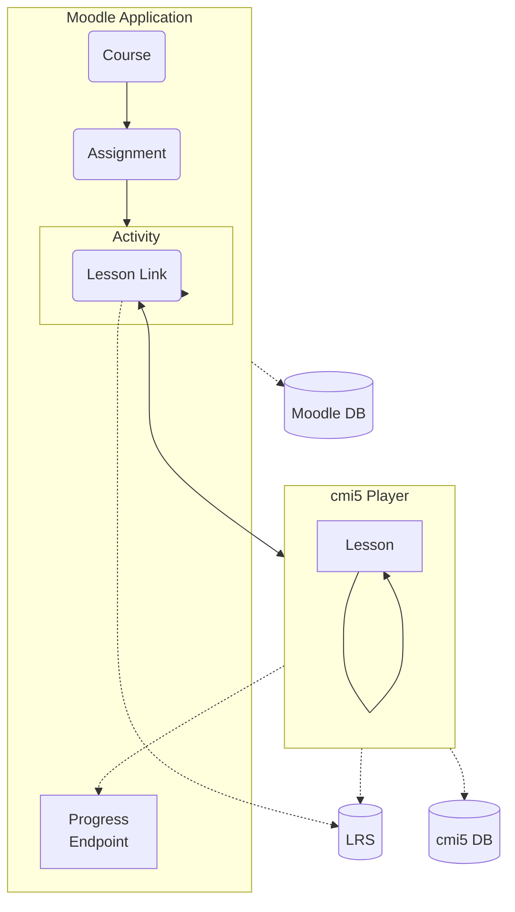
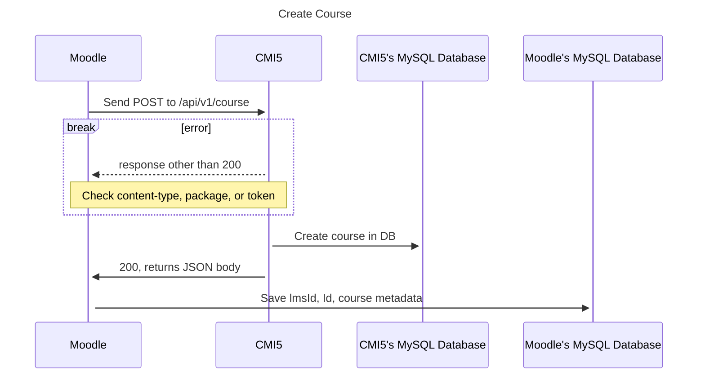
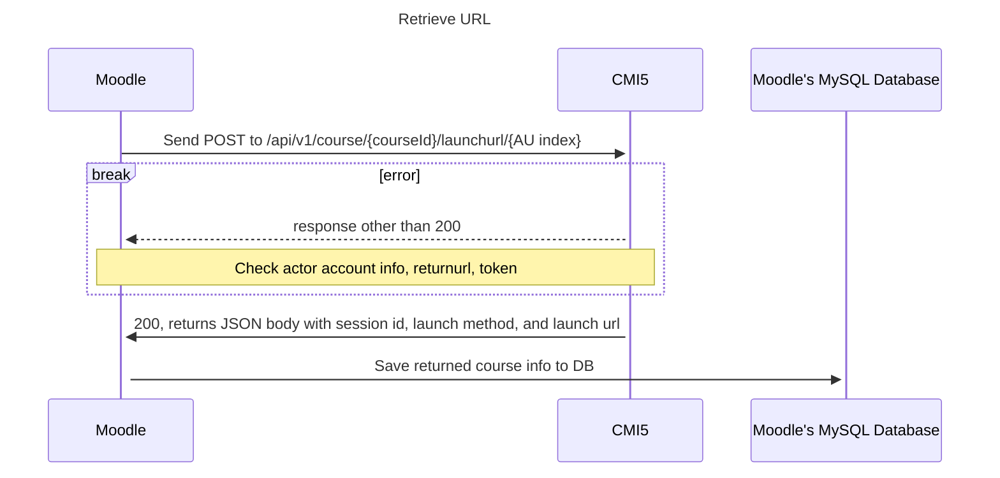

cmi5launch
============

A plug in for Moodle that allows the launch of cmi5 content which is then played in a cmi5 player and tracked to a separate LRS. 

## What you will need

To use this plugin you will need the following:

* Moodle 4.0+
* Login details for the admin account 
* A Moodle course setup where you would like to add the activity
* A cmi5 package in compliance with the cmi5 Specification (https://github.com/AICC/CMI-5_Spec_Current/blob/quartz/cmi5_spec.md)
* A Learning Record Store (LRS) as defined in the xAPI specification (https://opensource.ieee.org/xapi/xapi-base-standard-documentation)
* A running instance of the cmi5 prototype player (https://github.com/adlnet/CATAPULT/tree/main/player)
* A copy of this plugin

## Installation Instructions

Once the plugin is downloaded, be sure it is entirely in a file named 'cmi5launch.' Then compress that file into zip. The zip file _must_ be named 'cmi5_moodle.zip' to be uploaded to Moodle.

### Install plugin in Moodle

To install the CMI5 plugin into Moodle - 
- Go to _Site Administration_
- Go to _Plugins_
- Click on _Install Plugins_
  - Currently the only way to install plugin is via zip file
- Under _Install plugin from ZIP file_ upload the plugin. It must be in a zip file named 'cmi5_moodle.zip'.
  - Follow the Moodle instructions to upload plugin to the site

Once Moodle has finished uploading the plugin it will brin up the _cmi5 Launch Link_ settings page. This will enable you to set the information to connect to your LRS and instance of your running CMI5 player. These are the fields:
- Endpoint
  - The LRS endpoint, to enable the plugin to communicate with your LRS. Ex: https://lrsendpoint.com/data/xAPI/. Must include trailing forward slash.
- LRS integration 
  - This is an optional dropdown for addtional LRS's. Defaults to 'None.'
- LRS: Basic Username
  - The basic username for connecting to your LRS.
- LRS: Basic Password
  - Your password for connecting to your LRS. 
- Duration
   - Used with 'LRS integrated basic authentication'. Requests the LRS to keep credentials valid for this number of minutes. Default is set to 9000.
- Custom account homepage
  - If entered, Moodle will use this homePage in conjunction with the ID number user profile field to identify the learner. Defaults to https://moodle.com.
- Identify by email
  - If selected, learners will be identified by their email address if they have one recorded in Moodle.
- cmi5 Player URL 
  -The URL to communicate with the CMI5 player, can include port number(e.g. http://player.example.com or http://localhost:63398). Must NOT include a trailing forward slash.
- cmi5 Player: Basic Username
  - This is the tenant username for the CMI5 player
- cmi5 Player: Basic Password
  - This is the basic password to login to player. (IS this needed? check code - MB)
- cmi5 Player: Bearer Token
  - The cmi5 tenant bearer token (should be a long string). 

There are two sections "Default ccalues foor CMI5 LAunch Link activity grades" and "Default values for CMI5 Launch Link activity attempts and completion." These can be ignored for now as they are works in progress for future features. 

The plugin is now accessible as a resource to be added to a Moodle course! Under your Moodle courses in edit mode select _Add activity or resource_ and you will see _cmi5 Launch Link_ as an available option. Currently the Launch link can take a folder or XML compliant with cmi5 specification.

# Flowchart

This flowchart shows the path a user takes to get to a cmi5 Lesson Link. Once the link is clicked, the cmi5 Player opens in a new tab or window. The Moodle Application negotiates the connection by supplying credentials, tenant, and the current user session information. The Lesson Link contains a token in which both sides can track the user.

## Sequence diagrams for connecting to CMI5 player

Following are the two functions Moodle uses to create a course and retrieve a course URL from the CMI5 player.

### Create course

### Retrieve launch URL

## User progress

The cmi5 player tracks user progress by tracking whether an AU is satisfied or not. The LRS is a better way to track a users progress in any detail. Currently the Moodle plugin queries the LRS for progress. This in shows AUs as complete, in-progress, or not attempted. It also breaks down sessions into detail, ex; " The actor watched video at  certain time".

